<h1 align="center">¡Hola, soy Eli Samuel! 👋</h1>
<h3 align="center">Desarrollador de Software | QA & Testing Enthusiast</h3>

  

  
  

  
  

---

  

---

<!-- ===================== SOBRE MÍ + TECNOLOGÍAS EN 2 COLUMNAS ===================== -->
<table width="100%">
  <tr>
    <td width="50%" valign="top">

### 🧑‍💻 Sobre mí

- 🔭 Desarrollando proyectos como **Desarrollador de Software**, enfocado en buenas prácticas y calidad
- 🌱 Profundizando en **QA / Testing** (automatización, testing de APIs, seguridad, accesibilidad y UX)
- 💡 Combino **desarrollo** con **aseguramiento de calidad** para software robusto y confiable
- 🖥️ Fanático de **Linux**, el hardware y el PC gaming
- 📫 Contacto: **suerorodriguezsamuel@gmail.com**

</td>
<td width="50%" valign="top">

### 🛠️ Tecnologías

  

**Lenguajes**

**Bases de datos**

**QA / Testing**

**Sistemas y herramientas**

</td>
  </tr>
</table>

---

<!-- ===================== ESTADÍSTICAS EN 2 COLUMNAS ===================== -->
### 📊 Estadísticas de GitHub

<table width="100%">
  <tr>
    <td width="34%">
      
    </td>
    <td width="33%">
      
    </td>
    <td width="33%">
      
    </td>
  </tr>
</table>

  

---

### 🐍 Actividad de contribuciones

  

  

<i>Gracias por visitar mi perfil ✨</i>

